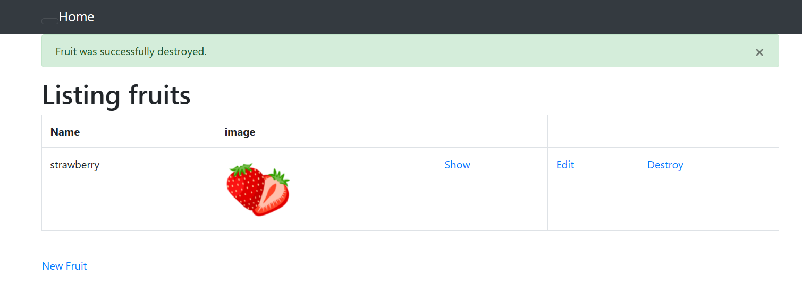
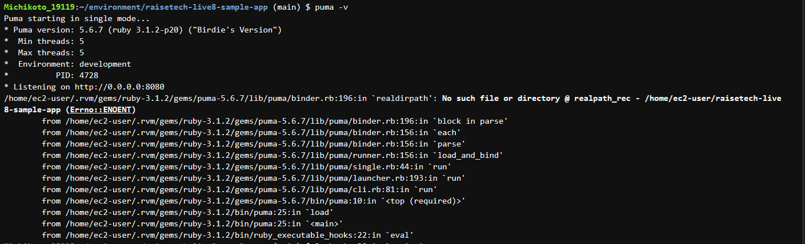
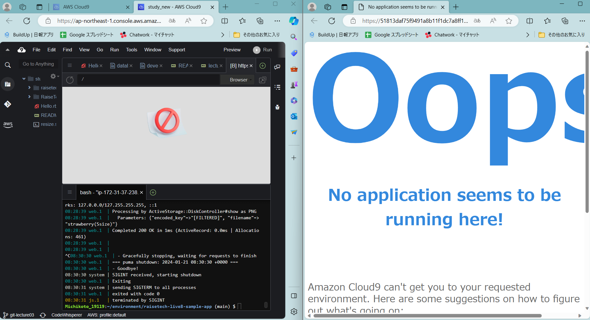
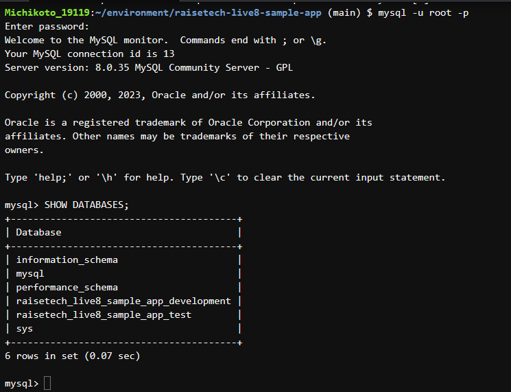
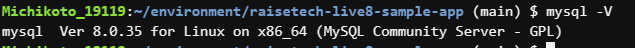
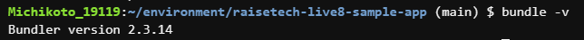
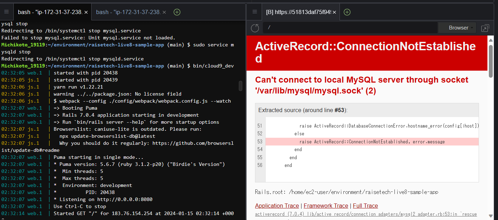
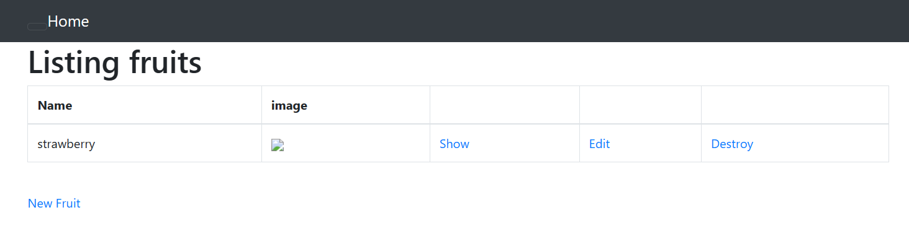
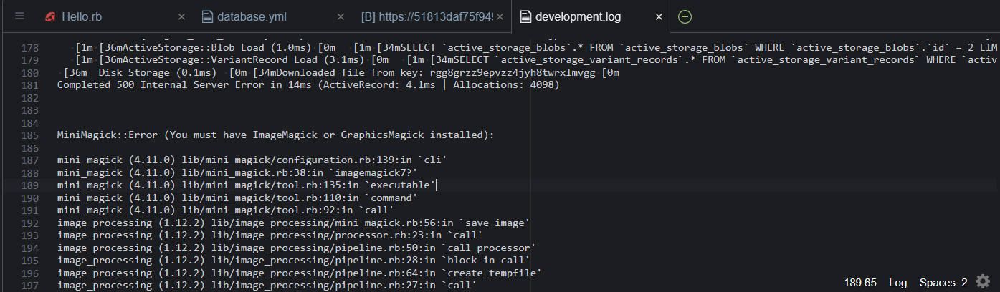

# lecture3 アプリケーションの構築
- トークンを設定した記憶が無かった
- Windowsならではの事象が起こったりして慌てたが、エラーコードは落ち着いて読めるようになってきたのでちょっと進歩しました  

## アプリケーションサーバーについて調べる

- `puma -v`  
Puma version: 5.6.7 (ruby 3.1.2-p20) ("Birdie's Version")  

### puma stop時にどうなるか  
- Railsアプリケーションの表示ができました

## DBサーバーについて調べる  
 - SHOW DATABASES;  

 - `mysql -V`  
sql Ver 8.0.35  
  

 - `bundle -v`  
Bundler version 2.3.14  
  

### mysqld stop時にどうなるか  
- Railsの画面は表示されなくなり、エラーとなりました
  

## アプリの表示が当初うまくいかなかった  
-  課題には無かったが、アプリを表示した時に貼り付けた画像が上手く表示され無かったので解消させてみた
-  ログがどこにあるか調べる　　アプリケーションの中？
-  ログがどこにあるか仮説を立てる　アプリケーション
-  本当にあるのか調べる　　アプリケーションのファイルバーの中から探せた  
  

### 結果、ImageMagickが無いというエラーがログに出ていたので解消できた

-  `sudo yum install -y ImageMagick`  

