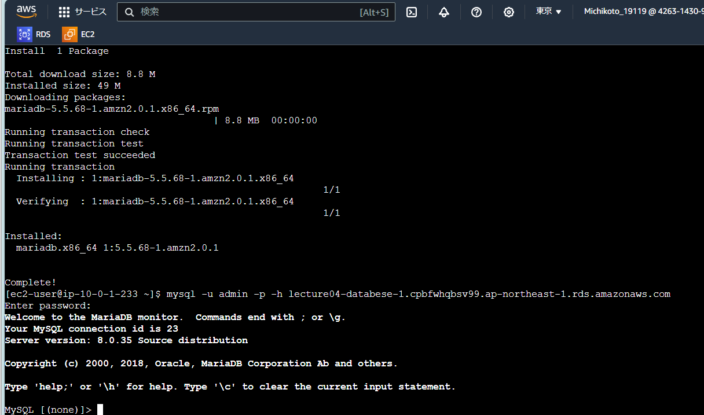

# lecture04の学び

- EC2・RDSを作り直しても、  
キーペア・セキュリティーグループ・サブネット・ルートテーブル・インターネットゲートウェイ  
が残るので流用できる  ということがわかった。  
※逆にEC2・RDSを削除しただけでは全部が残ってしまうので、関連する全てを削除したい時は  
気をつけなければいけない事を頭においておかなければならない。　
- SSH接続しなくてもEC2インスタンスコネクトで接続できる事がわかった。　
- セキュリティグループはEC2とRDSで分ける方がベストプラクティスということがわかった。  
（EC2とRDSではセキュリティ要件が違うので、分けた方が何かあった際に変更しやすいため）

##接続成功画像  
